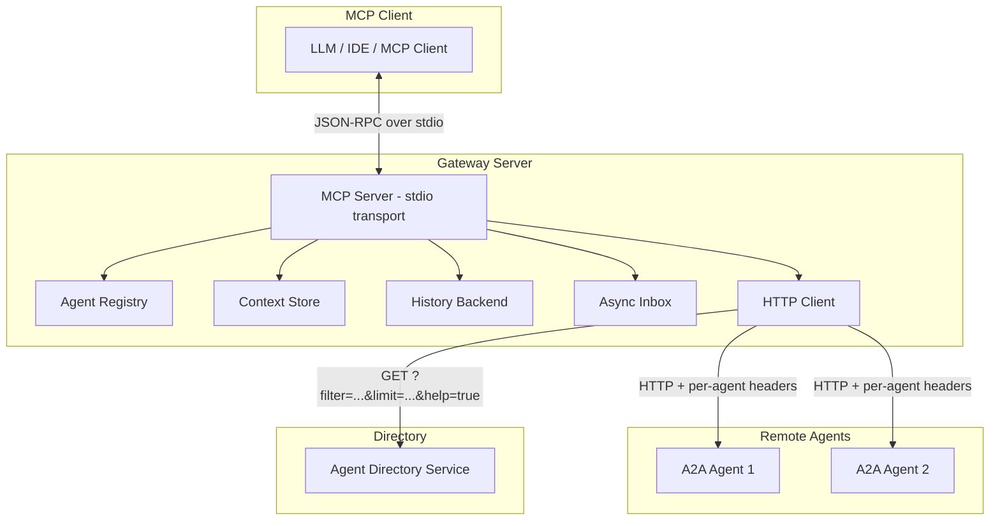

# a2a-gateway-mcp

[](https://github.com/nisimpson/a2a-gateway-mcp/actions/workflows/test.yml)
[](https://pkg.go.dev/github.com/nisimpson/a2a-gateway-mcp)
[](https://github.com/nisimpson/a2a-gateway-mcp/releases)

An MCP server that bridges the [Model Context Protocol](https://modelcontextprotocol.io/) and the [Agent-to-Agent (A2A) protocol](https://google.github.io/A2A/), enabling LLMs and MCP clients to discover, connect to, and communicate with remote A2A agents.

## Overview

a2a-gateway-mcp provides two main packages:

- **`gateway`** — An MCP server library that exposes up to 17 tools for managing and communicating with A2A agents through an ephemeral, session-scoped registry. Includes per-agent rate limiting, automatic streaming transport, structured message parts, caller agent card injection, async messaging with inbox, agent health checks, and per-agent interaction history.
- **`directory`** — A server-side agent directory service that stores agent cards and serves them over HTTP, acting as the counterpart to the gateway's `discover_agents` tool. Supports cursor-based pagination, filter help documentation via `?help=true`, and an optional `Querier` interface for database-backed registries to own the full query lifecycle.

The project also ships a standalone CLI binary that runs the gateway on stdio transport, ready to plug into any MCP-compatible client.

## Installation

```bash
go install github.com/nisimpson/a2a-gateway-mcp/cmd/a2a-gateway-mcp@latest
```

Or add the library to your project:

```bash
go get github.com/nisimpson/a2a-gateway-mcp
```

## Quick Start

### As a standalone MCP server

```bash
# Run with defaults
a2a-gateway-mcp

# Configure via environment variables
A2A_GATEWAY_NAME=my-gateway A2A_GATEWAY_VERSION=1.0.0 a2a-gateway-mcp
```

The server communicates over stdio using JSON-RPC, making it compatible with any MCP client (Claude Desktop, Cursor, Kiro, etc.).

### MCP client configuration

Add to your MCP client config (e.g., `mcp.json`):

```json
{
  "mcpServers": {
    "a2a-gateway": {
      "command": "a2a-gateway-mcp",
      "env": {
        "A2A_GATEWAY_NAME": "my-gateway"
      }
    }
  }
}
```

### As a Go library

```go
package main

import (
    "context"
    "log"

    "github.com/nisimpson/a2a-gateway-mcp/gateway"
)

func main() {
    srv := gateway.NewServer(
        gateway.WithName("my-gateway"),
        gateway.WithVersion("1.0.0"),
    )
    if err := srv.Run(context.Background()); err != nil {
        log.Fatal(err)
    }
}
```

## MCP Tools

The gateway exposes up to 17 tools to MCP clients (12 core + 2 history + 3 async/health tools):

| Tool | Description |
|------|-------------|
| `connect_agent` | Register a remote A2A agent with a friendly alias |
| `disconnect_agent` | Remove a registered agent by alias |
| `list_agents` | List all connected agents with aliases, URLs, and rate limits |
| `get_agent_card` | Retrieve an agent's capabilities from its card endpoint |
| `ping_agent` | Perform a liveness check on a registered agent to verify reachability |
| `send_message` | Send a text or multi-part message to an agent by alias or URL |
| `get_task` | Retrieve the current state of a previously initiated task |
| `cancel_task` | Cancel a running task on an A2A agent |
| `broadcast_message` | Send the same message to multiple agents concurrently |
| `discover_agents` | Query a remote agent directory for available agents |
| `create_caller_card` | Register a caller agent card for automatic outbound injection |
| `view_caller_card` | View the currently registered caller agent card |
| `remove_caller_card` | Remove the caller agent card |
| `get_history` | Retrieve interaction history for a connected agent |
| `clear_history` | Clear all interaction history for an agent without disconnecting |
| `check_inbox` | List inbox entries without consuming them (peek at async responses) |
| `read_inbox` | Read and consume inbox messages for a specific agent |

### connect_agent

Register an A2A agent with an alias for easy reference:

```json
{
  "alias": "code-reviewer",
  "agent_url": "https://agent.example.com",
  "headers": {
    "Authorization": "Bearer token123"
  },
  "rate_limit_rps": 10.0,
  "rate_limit_burst": 20,
  "ping_endpoint": "/healthz"
}
```

Optional `rate_limit_rps` and `rate_limit_burst` set a per-agent rate limit. Both must be provided together. Omit them to use the server's global default (if configured) or unlimited throughput.

Optional `ping_endpoint` sets a relative URL path for liveness checks (used by `ping_agent`). If not set, ping falls back to fetching the agent card endpoint.

### send_message

Send a message to a connected agent:

```json
{
  "agent": "code-reviewer",
  "message": "Review this pull request for security issues"
}
```

For structured or multi-part content, use `parts` instead of `message`:

```json
{
  "agent": "code-reviewer",
  "parts": [
    {"text": "Analyze this data:"},
    {"data": {"metrics": [1, 2, 3]}},
    {"url": "https://example.com/report.pdf"}
  ]
}
```

The gateway manages conversation context automatically — subsequent messages to the same agent continue the conversation. If the target agent supports streaming, the gateway uses SSE transport internally for lower latency (transparent to callers).

Set `async: true` to return immediately and deposit the response in the inbox for later retrieval via `check_inbox` / `read_inbox`.

### broadcast_message

Fan out a message to multiple agents simultaneously:

```json
{
  "aliases": ["code-reviewer", "summarizer", "translator"],
  "message": "Analyze this document",
  "timeout_seconds": 60
}
```

Returns per-agent results with success/error status for each. Set `async: true` to deposit all responses in the inbox instead of waiting.

### discover_agents

Query an agent directory service:

```json
{
  "directory_url": "https://directory.example.com/agents",
  "filter": "code review",
  "limit": 5
}
```

To retrieve filter help documentation from the directory (learn what filter syntax is supported):

```json
{
  "directory_url": "https://directory.example.com/agents",
  "help": true
}
```

When `help` is true, the tool returns structured documentation describing filter capabilities instead of agent cards.

### ping_agent

Check if a registered agent is reachable:

```json
{
  "alias": "code-reviewer"
}
```

Returns reachability status, health classification (healthy/unhealthy/unknown), and response time in milliseconds. Uses the agent's `ping_endpoint` if configured, otherwise falls back to the agent card endpoint.

### check_inbox

Peek at pending async responses without consuming them:

```json
{
  "alias": "code-reviewer"
}
```

Returns lightweight summaries (alias, task ID, state, timestamp) of pending inbox entries. Omit `alias` to see entries from all agents.

### read_inbox

Read and consume inbox messages for an agent:

```json
{
  "alias": "code-reviewer",
  "length": 5,
  "latest": false
}
```

Returns full message payloads and removes entries from the inbox. Use `length` to limit entries returned (FIFO order) or `latest: true` to pop all but return only the most recent.

### create_caller_card

Register a caller agent card that gets automatically injected into all outbound messages. This lets target agents discover your capabilities without a `.well-known/agent.json` endpoint:

```json
{
  "name": "my-assistant",
  "description": "An AI coding assistant",
  "skills": [{"name": "code-review", "description": "Reviews code for bugs"}],
  "capabilities": {"streaming": true}
}
```

Calling again replaces the previous card. Use `view_caller_card` to inspect and `remove_caller_card` to clear.

### get_history

Retrieve the interaction history for a connected agent:

```json
{
  "agent": "code-reviewer",
  "limit": 10
}
```

Returns a JSON array of history entries in chronological order (oldest first). Each entry includes the sent message summary, response summary, timestamp, context ID, task ID, and error flag. The optional `limit` parameter returns only the N most recent entries.

### clear_history

Clear all interaction history for an agent without disconnecting it:

```json
{
  "agent": "code-reviewer"
}
```

Returns a success confirmation. History for the agent is also automatically deleted when `disconnect_agent` is called.

## Agent Directory

The `directory` package provides the server-side counterpart — an HTTP service that `discover_agents` connects to.

### Standalone directory server

```go
package main

import (
    "context"
    "log"

    "github.com/a2aproject/a2a-go/v2/a2a"
    "github.com/nisimpson/a2a-gateway-mcp/directory"
)

func main() {
    dir := directory.New()

    ctx := context.Background()
    dir.Register(ctx, a2a.AgentCard{
        Name:        "code-reviewer",
        Description: "Reviews code for bugs and style issues",
        Skills: []a2a.AgentSkill{
            {ID: "review", Name: "Code Review", Tags: []string{"code", "review"}},
        },
    })

    log.Fatal(dir.ListenAndServe(ctx, ":8080"))
}
```

### Embedded in an existing server

```go
mux := http.NewServeMux()
mux.Handle("/agents", dir)
http.ListenAndServe(":8080", mux)
```

### HTTP API

```
GET /agents?filter=code&limit=10&cursor=<token>
```

Returns a JSON object with matching agent cards and an optional pagination cursor. Supports:
- `filter` — Case-insensitive substring search on name, description, and skill tags
- `limit` — Cap the number of results returned per page
- `cursor` — Opaque pagination token from a previous response's `next_token` field
- `help=true` — Return structured filter documentation instead of agent cards

Response format:

```json
{
  "cards": [...],
  "next_token": "opaque-cursor-for-next-page"
}
```

The `next_token` field is omitted when there are no more results.

#### Filter help documentation

```
GET /agents?help=true
```

Returns a JSON object describing the directory's filter capabilities:

```json
{
  "description": "Filters agent cards using case-insensitive substring matching.",
  "syntax": "Pass a plain text string as the filter parameter...",
  "examples": [
    {"filter": "weather", "description": "Agents related to weather"},
    {"filter": "code review", "description": "Agents that handle code review"}
  ],
  "filterable_fields": []
}
```

Custom resolvers can implement the `FilterHelper` interface to provide documentation specific to their filter syntax. The help resolution priority is: Registry `FilterHelper` → FilterResolver `FilterHelper` → default help. This means a `Querier`-implementing registry can also provide `FilterHelper` to document its custom filter syntax.

### Custom backends

The directory uses a pluggable `Registry` interface, defaulting to an in-memory store:

```go
dir := directory.New(
    directory.WithRegistry(myRedisRegistry),
    directory.WithFilterResolver(myElasticSearchResolver),
)
```

#### Filterer interface

Registries that support native filtering can implement the optional `Filterer` interface to push filter evaluation down to the storage layer:

```go
type Filterer interface {
    Filter(ctx context.Context, filter string) ([]a2a.AgentCard, error)
}
```

The handler still manages offset-based cursor pagination in memory.

#### Querier interface

For database-backed registries that need full control over filtering, pagination, and cursor management in a single query, implement the `Querier` interface:

```go
type Querier interface {
    Query(ctx context.Context, filter string, limit int, cursor string) ([]a2a.AgentCard, string, error)
}
```

When a registry implements `Querier`:
- The handler delegates the full query (filter + limit + cursor) in one call
- Cursor strings are treated as opaque — the handler never decodes or encodes them
- The implementation owns the pagination strategy (keyset, offset, token-based)
- `ErrInvalidCursor` signals a bad cursor (handler returns HTTP 400)

The handler uses a 3-tier priority chain: **Querier → Filterer → List+FilterResolver**. If a registry implements both `Querier` and `Filterer`, only the Querier path is used. The handler never falls back to a lower-priority path on error.

```go
// Example: database-backed Querier
func (r *PostgresRegistry) Query(ctx context.Context, filter string, limit int, cursor string) ([]a2a.AgentCard, string, error) {
    if limit < 0 {
        return nil, "", fmt.Errorf("negative limit: %w", directory.ErrInvalidCursor)
    }
    // Execute single DB query with WHERE, LIMIT, and cursor conditions
    // Return cards, next cursor token, and any error
}
```

## Architecture



## Configuration

### Environment Variables

| Variable | Default | Description |
|----------|---------|-------------|
| `A2A_GATEWAY_NAME` | `a2a-gateway-mcp` | MCP server name |
| `A2A_GATEWAY_VERSION` | `0.1.0` | MCP server version |

### Functional Options

```go
gateway.NewServer(
    gateway.WithName("custom-name"),
    gateway.WithVersion("2.0.0"),
    gateway.WithHTTPClient(customClient),
    gateway.WithRateLimit(10.0, 20), // 10 req/s, burst of 20 (global default)
    gateway.WithPollTimeout(90*time.Second),
    gateway.WithStreamTimeout(90*time.Second),
    gateway.WithHistory(gateway.HistoryOptions{
        Depth:          100,  // max entries per agent (default: 50, 0 to disable)
        MaxEntryLength: 2000, // max chars per text field (default: 1000)
    }),
)
```

### Rate Limiting

The gateway supports per-agent rate limiting using a token bucket algorithm. Configure a global default at server init, or set per-agent limits at connect time:

```go
// Global default: all agents get 10 req/s with burst of 20
srv := gateway.NewServer(gateway.WithRateLimit(10.0, 20))
```

Per-agent overrides are set via the `connect_agent` tool's `rate_limit_rps` and `rate_limit_burst` parameters. Setting `rate_limit_rps` to zero disables rate limiting for that agent. When no global default is configured and no per-agent limit is set, throughput is unlimited (backward compatible).

Rate-limited requests return an error with the agent alias and estimated wait time. In broadcasts, rate limits are evaluated independently per agent — some may succeed while others are rate-limited.

### Interaction History

The gateway automatically records interactions with each agent, enabling the MCP client to recall prior conversations without re-sending messages. History is enabled by default with a depth of 50 entries per agent.

```go
// Custom configuration
srv := gateway.NewServer(gateway.WithHistory(gateway.HistoryOptions{
    Depth:          100,  // max entries per agent
    MaxEntryLength: 2000, // max characters per summary field
}))

// Disable history entirely
srv := gateway.NewServer(gateway.WithHistory(gateway.HistoryOptions{Depth: 0}))

// Custom storage backend
srv := gateway.NewServer(gateway.WithHistory(gateway.HistoryOptions{
    Backend: myRedisBackend, // must implement gateway.HistoryBackend
}))
```

Built-in backends:
- **MemoryBackend** (default) — In-process storage, lost on restart
- **FileBackend** — Persists to one JSON file per agent in a configurable directory

```go
fileBackend, _ := gateway.NewFileBackend("/var/lib/a2a-history", 100)
srv := gateway.NewServer(gateway.WithHistory(gateway.HistoryOptions{
    Backend: fileBackend,
}))
```

When history is disabled (depth=0), the `get_history` and `clear_history` tools are not exposed. History for an agent is automatically deleted on `disconnect_agent`.

## Development

See [DEVELOPMENT.md](DEVELOPMENT.md) for build instructions, testing, and project structure.

## License

See [LICENSE](LICENSE) for details.
