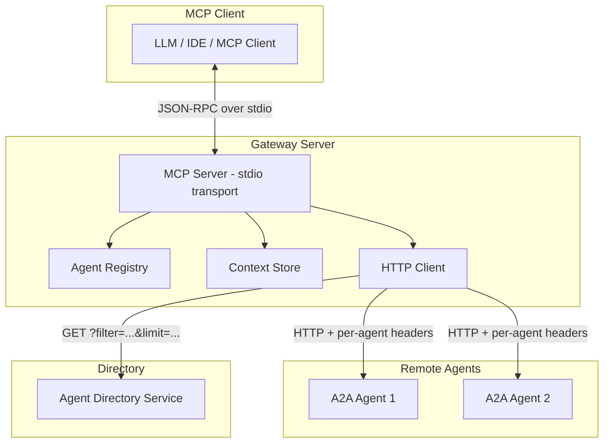

# a2a-gateway-mcp

[](https://github.com/nisimpson/a2a-gateway-mcp/actions/workflows/test.yml)
[](https://pkg.go.dev/github.com/nisimpson/a2a-gateway-mcp)
[](https://github.com/nisimpson/a2a-gateway-mcp/releases)

An MCP server that bridges the [Model Context Protocol](https://modelcontextprotocol.io/) and the [Agent-to-Agent (A2A) protocol](https://google.github.io/A2A/), enabling LLMs and MCP clients to discover, connect to, and communicate with remote A2A agents.

## Overview

a2a-gateway-mcp provides two main packages:

- **`gateway`** — An MCP server library that exposes 12 tools for managing and communicating with A2A agents through an ephemeral, session-scoped registry. Includes per-agent rate limiting, automatic streaming transport, structured message parts, and caller agent card injection.
- **`directory`** — A server-side agent directory service that stores agent cards and serves them over HTTP, acting as the counterpart to the gateway's `discover_agents` tool.

The project also ships a standalone CLI binary that runs the gateway on stdio transport, ready to plug into any MCP-compatible client.

## Installation

```bash
go install github.com/nisimpson/a2a-gateway-mcp/cmd/a2a-gateway-mcp@latest
```

Or add the library to your project:

```bash
go get github.com/nisimpson/a2a-gateway-mcp
```

## Quick Start

### As a standalone MCP server

```bash
# Run with defaults
a2a-gateway-mcp

# Configure via environment variables
A2A_GATEWAY_NAME=my-gateway A2A_GATEWAY_VERSION=1.0.0 a2a-gateway-mcp
```

The server communicates over stdio using JSON-RPC, making it compatible with any MCP client (Claude Desktop, Cursor, Kiro, etc.).

### MCP client configuration

Add to your MCP client config (e.g., `mcp.json`):

```json
{
  "mcpServers": {
    "a2a-gateway": {
      "command": "a2a-gateway-mcp",
      "env": {
        "A2A_GATEWAY_NAME": "my-gateway"
      }
    }
  }
}
```

### As a Go library

```go
package main

import (
    "context"
    "log"

    "github.com/nisimpson/a2a-gateway-mcp/gateway"
)

func main() {
    srv := gateway.NewServer(
        gateway.WithName("my-gateway"),
        gateway.WithVersion("1.0.0"),
    )
    if err := srv.Run(context.Background()); err != nil {
        log.Fatal(err)
    }
}
```

## MCP Tools

The gateway exposes 12 tools to MCP clients:

| Tool | Description |
|------|-------------|
| `connect_agent` | Register a remote A2A agent with a friendly alias |
| `disconnect_agent` | Remove a registered agent by alias |
| `list_agents` | List all connected agents with aliases, URLs, and rate limits |
| `get_agent_card` | Retrieve an agent's capabilities from its card endpoint |
| `send_message` | Send a text or multi-part message to an agent by alias or URL |
| `get_task` | Retrieve the current state of a previously initiated task |
| `cancel_task` | Cancel a running task on an A2A agent |
| `broadcast_message` | Send the same message to multiple agents concurrently |
| `discover_agents` | Query a remote agent directory for available agents |
| `create_caller_card` | Register a caller agent card for automatic outbound injection |
| `view_caller_card` | View the currently registered caller agent card |
| `remove_caller_card` | Remove the caller agent card |

### connect_agent

Register an A2A agent with an alias for easy reference:

```json
{
  "alias": "code-reviewer",
  "agent_url": "https://agent.example.com",
  "headers": {
    "Authorization": "Bearer token123"
  },
  "rate_limit_rps": 10.0,
  "rate_limit_burst": 20
}
```

Optional `rate_limit_rps` and `rate_limit_burst` set a per-agent rate limit. Both must be provided together. Omit them to use the server's global default (if configured) or unlimited throughput.

### send_message

Send a message to a connected agent:

```json
{
  "agent": "code-reviewer",
  "message": "Review this pull request for security issues"
}
```

For structured or multi-part content, use `parts` instead of `message`:

```json
{
  "agent": "code-reviewer",
  "parts": [
    {"text": "Analyze this data:"},
    {"data": {"metrics": [1, 2, 3]}},
    {"url": "https://example.com/report.pdf"}
  ]
}
```

The gateway manages conversation context automatically — subsequent messages to the same agent continue the conversation. If the target agent supports streaming, the gateway uses SSE transport internally for lower latency (transparent to callers).

### broadcast_message

Fan out a message to multiple agents simultaneously:

```json
{
  "aliases": ["code-reviewer", "summarizer", "translator"],
  "message": "Analyze this document",
  "timeout_seconds": 60
}
```

Returns per-agent results with success/error status for each.

### discover_agents

Query an agent directory service:

```json
{
  "directory_url": "https://directory.example.com/agents",
  "query": "code review",
  "limit": 5
}
```

### create_caller_card

Register a caller agent card that gets automatically injected into all outbound messages. This lets target agents discover your capabilities without a `.well-known/agent.json` endpoint:

```json
{
  "name": "my-assistant",
  "description": "An AI coding assistant",
  "skills": [{"name": "code-review", "description": "Reviews code for bugs"}],
  "capabilities": {"streaming": true}
}
```

Calling again replaces the previous card. Use `view_caller_card` to inspect and `remove_caller_card` to clear.

## Agent Directory

The `directory` package provides the server-side counterpart — an HTTP service that `discover_agents` connects to.

### Standalone directory server

```go
package main

import (
    "context"
    "log"

    "github.com/a2aproject/a2a-go/v2/a2a"
    "github.com/nisimpson/a2a-gateway-mcp/directory"
)

func main() {
    dir := directory.New()

    ctx := context.Background()
    dir.Register(ctx, a2a.AgentCard{
        Name:        "code-reviewer",
        Description: "Reviews code for bugs and style issues",
        Skills: []a2a.AgentSkill{
            {ID: "review", Name: "Code Review", Tags: []string{"code", "review"}},
        },
    })

    log.Fatal(dir.ListenAndServe(ctx, ":8080"))
}
```

### Embedded in an existing server

```go
mux := http.NewServeMux()
mux.Handle("/agents", dir)
http.ListenAndServe(":8080", mux)
```

### HTTP API

```
GET /agents?filter=code&limit=10
```

Returns a JSON array of matching agent cards. Supports:
- `filter` — Case-insensitive substring search on name, description, and skill tags
- `limit` — Cap the number of results returned

### Custom backends

The directory uses a pluggable `Registry` interface, defaulting to an in-memory store:

```go
dir := directory.New(
    directory.WithRegistry(myRedisRegistry),
    directory.WithFilterResolver(myElasticSearchResolver),
)
```

Registries that support native querying can implement the optional `Filterer` interface to push filtering down to the storage layer.

## Architecture



## Configuration

### Environment Variables

| Variable | Default | Description |
|----------|---------|-------------|
| `A2A_GATEWAY_NAME` | `a2a-gateway-mcp` | MCP server name |
| `A2A_GATEWAY_VERSION` | `0.1.0` | MCP server version |

### Functional Options

```go
gateway.NewServer(
    gateway.WithName("custom-name"),
    gateway.WithVersion("2.0.0"),
    gateway.WithHTTPClient(customClient),
    gateway.WithRateLimit(10.0, 20), // 10 req/s, burst of 20 (global default)
    gateway.WithPollTimeout(90*time.Second),
    gateway.WithStreamTimeout(90*time.Second),
)
```

### Rate Limiting

The gateway supports per-agent rate limiting using a token bucket algorithm. Configure a global default at server init, or set per-agent limits at connect time:

```go
// Global default: all agents get 10 req/s with burst of 20
srv := gateway.NewServer(gateway.WithRateLimit(10.0, 20))
```

Per-agent overrides are set via the `connect_agent` tool's `rate_limit_rps` and `rate_limit_burst` parameters. Setting `rate_limit_rps` to zero disables rate limiting for that agent. When no global default is configured and no per-agent limit is set, throughput is unlimited (backward compatible).

Rate-limited requests return an error with the agent alias and estimated wait time. In broadcasts, rate limits are evaluated independently per agent — some may succeed while others are rate-limited.

## Development

See [DEVELOPMENT.md](DEVELOPMENT.md) for build instructions, testing, and project structure.

## License

See [LICENSE](LICENSE) for details.
