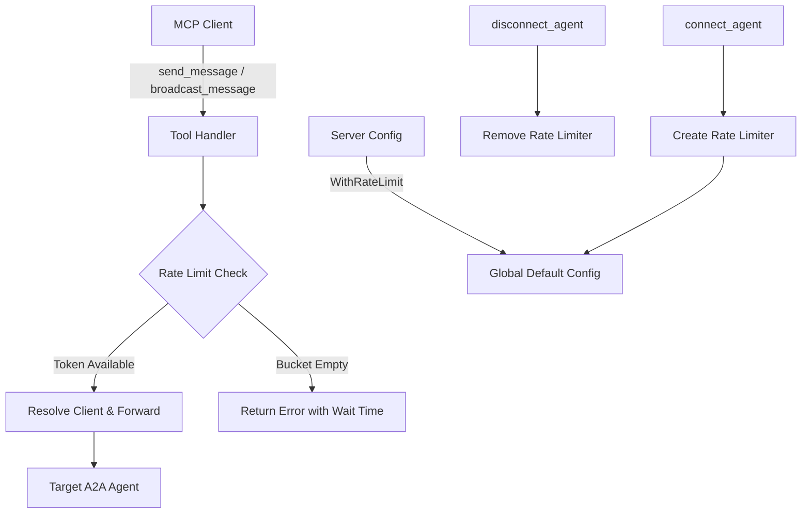

# Design Document

## Overview

This design adds per-agent rate limiting to the A2A Gateway MCP server using a token bucket algorithm. Each registered agent gets its own rate limiter, configured either via a server-wide default or per-agent override at connect time. Rate limiting is enforced before any outbound HTTP request, providing backpressure to MCP clients and protecting target A2A agents from being overwhelmed.

The implementation uses Go's `golang.org/x/time/rate` package (standard token bucket) and integrates into existing patterns: functional options for server config, the `AgentRegistry` for limiter lifecycle, and tool handlers for enforcement.

## Architecture

All changes are localized to the `gateway` package. The design introduces a `RateLimiterRegistry` that shadows the `AgentRegistry` lifecycle — when agents connect/disconnect, their rate limiters are created/destroyed in tandem.



### Design Decisions

1. **Separate `RateLimiterRegistry` vs embedding in `AgentRegistry`**: A separate registry keeps rate limiting concerns decoupled from agent registration. The `AgentRegistry` stays unchanged, and the `RateLimiterRegistry` is managed alongside it in the `Server` struct. This avoids modifying the well-tested registry and makes it easy to disable rate limiting entirely.

2. **`golang.org/x/time/rate` vs custom implementation**: The standard library rate limiter is battle-tested, thread-safe, and implements token bucket with configurable rate and burst. No need to implement from scratch.

3. **Rate limit check placement**: Enforcement happens in tool handlers (send_message, broadcast_message) before client resolution. This ensures no outbound request is made for rate-limited calls.

4. **Direct URL sends skip rate limiting**: Only alias-based sends have associated rate limiters. Direct URL sends bypass rate limiting because there's no registered agent entry to associate a limiter with. This is intentional — unregistered URLs are one-off and don't have rate limit config.

## Components and Interfaces

### Component 1: RateLimiterRegistry

A thread-safe map of agent aliases to `*rate.Limiter` instances.

```go
// RateLimiterRegistry manages per-agent rate limiters.
type RateLimiterRegistry struct {
    mu       sync.RWMutex
    limiters map[string]*rate.Limiter // key: agent alias
}

// NewRateLimiterRegistry creates an empty registry.
func NewRateLimiterRegistry() *RateLimiterRegistry

// Set creates or replaces the rate limiter for an alias.
// If rps <= 0 or burst <= 0, the entry is removed (no limit).
func (r *RateLimiterRegistry) Set(alias string, rps float64, burst int)

// Remove deletes the rate limiter for an alias.
func (r *RateLimiterRegistry) Remove(alias string)

// Allow checks if a request to the given alias is allowed.
// Returns true if allowed (token consumed), false if rate limited.
// If no limiter exists for the alias, returns true (no limit).
func (r *RateLimiterRegistry) Allow(alias string) bool

// Reserve checks if a request to the given alias is allowed.
// Returns a Reservation that indicates when the next token will be available.
// If no limiter exists for the alias, returns nil (no limit).
func (r *RateLimiterRegistry) Reserve(alias string) *rate.Reservation

// Get returns the rate limit config for an alias, or nil if unlimited.
func (r *RateLimiterRegistry) Get(alias string) (rps float64, burst int, exists bool)

// Len returns the number of active limiters.
func (r *RateLimiterRegistry) Len() int
```

**Validates: RLIM-1.1, RLIM-1.5, RLIM-1.7**

### Component 2: Server Configuration Extension

New functional option and server fields for the global default rate limit.

```go
// RateLimitConfig holds rate limit parameters.
type RateLimitConfig struct {
    RequestsPerSecond float64
    Burst             int
}

// WithRateLimit sets the global default rate limit for all agents.
// A zero RPS or zero burst means rate limiting is disabled (unlimited).
func WithRateLimit(requestsPerSecond float64, burst int) Option

// Server gains:
//   rateLimiters  *RateLimiterRegistry
//   defaultRateLimit *RateLimitConfig // nil means no global default (unlimited)
```

**Validates: RLIM-3.1, RLIM-3.2, RLIM-3.4**

### Component 3: ConnectAgentInput Extension

```go
// ConnectAgentInput gains optional rate limit fields:
type ConnectAgentInput struct {
    Alias         string            `json:"alias" ...`
    AgentURL      string            `json:"agent_url" ...`
    Headers       map[string]string `json:"headers,omitempty" ...`
    RateLimitRPS  *float64          `json:"rate_limit_rps,omitempty" jsonschema:"requests per second rate limit for this agent (must be provided with rate_limit_burst)"`
    RateLimitBurst *int             `json:"rate_limit_burst,omitempty" jsonschema:"burst capacity for this agent's rate limiter (must be provided with rate_limit_rps)"`
}
```

**Validates: RLIM-4.1, RLIM-4.2, RLIM-4.3, RLIM-4.5**

### Component 4: Rate Limit Enforcement in Tool Handlers

Rate limiting is checked in `handleSendMessage` and `broadcastToAgent` before client resolution.

```go
// In handleSendMessage, after resolving agent alias:
if resolved.IsAlias {
    if reservation := s.rateLimiters.Reserve(resolved.Alias); reservation != nil && !reservation.OK() {
        // Should not happen with rate.Limiter but handle gracefully
    } else if reservation != nil && reservation.Delay() > 0 {
        reservation.Cancel()
        waitTime := reservation.Delay()
        // Return rate limit error with alias and wait time
    }
}

// Simplified: use Allow() for non-blocking check
if resolved.IsAlias && !s.rateLimiters.Allow(resolved.Alias) {
    // Return rate limit error
}
```

The actual approach: use `rate.Limiter.Reserve()` to get the wait time for the error message, then `Cancel()` the reservation to not consume the token.

**Validates: RLIM-1.4, RLIM-1.6, RLIM-2.1, RLIM-5.1, RLIM-5.2, RLIM-5.3**

### Component 5: Rate Limit Error Response

```go
// checkRateLimit checks the rate limiter for an alias and returns an error
// result if the request is rate limited, or nil if allowed.
func (s *Server) checkRateLimit(alias string) *mcp.CallToolResult {
    reservation := s.rateLimiters.Reserve(alias)
    if reservation == nil {
        return nil // no limiter = unlimited
    }
    if reservation.Delay() == 0 {
        return nil // token available, consumed
    }
    // Rate limited — cancel reservation and return error
    reservation.Cancel()
    waitTime := reservation.Delay()
    msg := fmt.Sprintf("rate limited: agent %q has exceeded its rate limit; retry after %s", alias, waitTime.Round(time.Millisecond))
    return &mcp.CallToolResult{
        IsError: true,
        Content: []mcp.Content{&mcp.TextContent{Text: msg}},
    }
}
```

**Validates: RLIM-2.1, RLIM-2.2**

### Component 6: Broadcast Partial Success

In `broadcastToAgent`, the rate limit check occurs at the beginning of each goroutine. If rate limited, the individual result reports the error while other agents proceed normally.

```go
func (s *Server) broadcastToAgent(...) *broadcastResult {
    entry := s.registry.Lookup(alias)
    if entry == nil { ... }

    // Rate limit check before any outbound work
    if !s.rateLimiters.Allow(alias) {
        return &broadcastResult{
            Status: "error",
            Error:  fmt.Sprintf("rate limited: agent %q has exceeded its rate limit", alias),
        }
    }
    // ... proceed with sending
}
```

**Validates: RLIM-2.3, RLIM-2.4**

### Component 7: List Agents with Rate Limit Info

Extend `listAgentEntry` to include rate limit config:

```go
type listAgentEntry struct {
    Alias        string  `json:"alias"`
    URL          string  `json:"url"`
    RateLimit    string  `json:"rate_limit"` // e.g., "10.00 rps, burst 20" or "unlimited"
}
```

**Validates: RLIM-6.1, RLIM-6.2**

## Data Models

### RateLimitConfig

```go
type RateLimitConfig struct {
    RequestsPerSecond float64 // tokens added per second
    Burst             int     // max tokens (burst capacity)
}

// IsDisabled returns true if the config represents "no rate limiting".
func (c *RateLimitConfig) IsDisabled() bool {
    return c.RequestsPerSecond <= 0 || c.Burst <= 0
}
```

### Extended Server struct

```go
type Server struct {
    // ... existing fields ...
    rateLimiters     *RateLimiterRegistry
    defaultRateLimit *RateLimitConfig // nil = no global default (unlimited)
}
```

### Extended serverConfig

```go
type serverConfig struct {
    // ... existing fields ...
    rateLimitRPS   float64
    rateLimitBurst int
}
```

### Integration Points

| Operation | Where | What Happens |
|-----------|-------|--------------|
| Server init | `NewServer()` | Create `RateLimiterRegistry`, store global default config |
| Connect agent | `handleConnectAgent` | Validate rate limit params, create limiter via `rateLimiters.Set()` |
| Disconnect agent | `handleDisconnectAgent` | Remove limiter via `rateLimiters.Remove()` |
| Send message | `handleSendMessage` | Call `checkRateLimit(alias)` before client resolution |
| Broadcast | `broadcastToAgent` | Call `rateLimiters.Allow(alias)` before sending |
| List agents | `handleListAgents` | Query `rateLimiters.Get(alias)` for each entry |

## Correctness Properties

*A property is a characteristic or behavior that should hold true across all valid executions of a system — essentially, a formal statement about what the system should do. Properties serve as the bridge between human-readable specifications and machine-verifiable correctness guarantees.*

### Property 1: Rate limiter count invariant

*For any* sequence of connect and disconnect operations with distinct aliases, the number of active rate limiters SHALL equal the number of registered agents in the registry at all times (when a global default is configured).

**Validates: Requirements RLIM-1.1, RLIM-1.3**

### Property 2: Token consumption correctly gates requests

*For any* agent with a rate limiter configured with burst capacity B, sending B+1 requests in rapid succession (faster than token refill) SHALL result in exactly B successful requests and 1 rejected request.

**Validates: Requirements RLIM-1.4, RLIM-1.6, RLIM-5.1**

### Property 3: Rate limit error message contains required information

*For any* agent alias and rate limit configuration, when a request is rejected due to rate limiting, the error message SHALL contain the agent alias string and a non-negative wait duration.

**Validates: Requirements RLIM-2.2**

### Property 4: Broadcast evaluates limits independently with partial success

*For any* set of agents where some are rate-limited (tokens exhausted) and others are not, a broadcast to all agents SHALL produce successful results for non-limited agents and error results for rate-limited agents, with both present in the final response.

**Validates: Requirements RLIM-2.3, RLIM-2.4**

### Property 5: No rate limit configured means unlimited throughput

*For any* server with no global default rate limit and no per-agent rate limit, all requests SHALL succeed regardless of the number or frequency of requests.

**Validates: Requirements RLIM-3.2**

### Property 6: Per-agent config overrides global default

*For any* agent connected with explicit rate_limit_rps and rate_limit_burst values, the agent's rate limiter SHALL use those values regardless of the global default rate limit configuration.

**Validates: Requirements RLIM-4.2, RLIM-1.2, RLIM-3.3**

### Property 7: Reconnection replaces rate limiter with new config

*For any* agent that is reconnected with a different rate limit configuration, the new rate limiter SHALL use the updated configuration, and the previous limiter's token state SHALL not carry over.

**Validates: Requirements RLIM-4.4**

### Property 8: Direct URL sends bypass rate limiting

*For any* number of rapid requests sent to an agent by direct URL (not alias), all requests SHALL succeed without rate limit rejection, even when a global default rate limit is configured.

**Validates: Requirements RLIM-5.2**

### Property 9: List agents includes rate limit info

*For any* set of connected agents with various rate limit configurations (per-agent, global default, or unlimited), the list_agents output SHALL include the correct rate limit description for each agent.

**Validates: Requirements RLIM-6.1, RLIM-6.2**

### Property 10: Concurrent rate limit checks are safe

*For any* number of concurrent goroutines performing rate limit checks against the same agent, all operations SHALL complete without panic or data race, and the total number of allowed requests SHALL not exceed the burst capacity (for a zero-refill window).

**Validates: Requirements RLIM-1.7**

## Error Handling

| Scenario | Response |
|----------|----------|
| Request rate limited | `IsError: true`, message: `"rate limited: agent \"<alias>\" has exceeded its rate limit; retry after <duration>"` |
| Partial rate limit in broadcast | Individual agent result: `{status: "error", error: "rate limited: agent \"<alias>\" has exceeded its rate limit"}` |
| Only one of rps/burst provided at connect | `IsError: true`, message: `"rate_limit_rps and rate_limit_burst must both be provided together"` |
| Invalid rate limit values (negative) | `IsError: true`, message: `"rate_limit_rps must be non-negative"` or `"rate_limit_burst must be non-negative"` |
| Agent not found during rate check | No rate limit applied (pass through — the agent resolution will fail later with existing error) |

## Testing Strategy

### Property-Based Tests (gopter)

The following property-based tests validate the correctness properties using `gopter` with minimum 100 iterations each:

| Test | Property | Generators |
|------|----------|-----------|
| `TestPropertyRateLimiterCountInvariant` | Property 1 | Random connect/disconnect operation sequences |
| `TestPropertyTokenConsumptionGatesRequests` | Property 2 | Random burst capacities (1-100), rapid request counts |
| `TestPropertyRateLimitErrorMessage` | Property 3 | Random alias strings, random RPS/burst configs |
| `TestPropertyBroadcastPartialSuccess` | Property 4 | Random agent sets with mixed rate limit states |
| `TestPropertyNoRateLimitUnlimited` | Property 5 | Random request counts (1-200) |
| `TestPropertyPerAgentOverridesGlobal` | Property 6 | Random global and per-agent configs |
| `TestPropertyReconnectionReplacesLimiter` | Property 7 | Random config pairs |
| `TestPropertyDirectURLBypassesRateLimit` | Property 8 | Random request counts |
| `TestPropertyListAgentsIncludesRateLimit` | Property 9 | Random agent sets with various configs |
| `TestPropertyConcurrentRateLimitSafety` | Property 10 | Random goroutine counts (2-50), random burst sizes |

### Unit Tests (example-based)

- `TestConnectAgentWithRateLimit` — verifies per-agent rate limit is created
- `TestConnectAgentMissingOnlyRPS` — verifies error when only RPS provided
- `TestConnectAgentMissingOnlyBurst` — verifies error when only burst provided
- `TestConnectAgentZeroRPSDisables` — verifies zero RPS disables rate limiting
- `TestSendMessageRateLimited` — verifies rejected send returns proper error
- `TestSendMessageWithinLimit` — verifies allowed send proceeds normally
- `TestBroadcastMixedRateLimits` — verifies partial success response format
- `TestRateLimitCheckBeforeClientResolve` — verifies no HTTP call made when rate limited
- `TestListAgentsShowsRateLimitConfig` — verifies list output format

### Integration Tests

- End-to-end test with `httptest` server verifying rate limiting behavior across multiple sends
- Verify backward compatibility: server without `WithRateLimit` has no rate limiting

### Test Configuration

- PBT library: `github.com/leanovate/gopter`
- Minimum iterations: 100
- Each property test tagged with: `// Feature: rate-limiting, Property {N}: {title}`
- Race detector enabled: `go test -race ./gateway/...`

## Files Changed

| File | Change |
|------|--------|
| `gateway/rate_limiter.go` | New: `RateLimiterRegistry`, `RateLimitConfig`, `checkRateLimit` method |
| `gateway/rate_limiter_test.go` | New: property-based tests and unit tests for rate limiter |
| `gateway/server.go` | Add `rateLimiters` and `defaultRateLimit` fields, `WithRateLimit` option |
| `gateway/tools.go` | Add `RateLimitRPS` and `RateLimitBurst` fields to `ConnectAgentInput` |
| `gateway/tool_connect.go` | Create/replace rate limiter on connect, validate rate limit params |
| `gateway/tool_disconnect.go` | Remove rate limiter on disconnect |
| `gateway/tool_send.go` | Add `checkRateLimit` call before client resolution |
| `gateway/tool_broadcast.go` | Add rate limit check in `broadcastToAgent` |
| `gateway/tool_list.go` | Include rate limit info in list response |
| `gateway/tool_connect_test.go` | Add tests for rate limit params at connect |
| `gateway/tool_send_test.go` | Add tests for rate-limited sends |
| `gateway/tool_broadcast_test.go` | Add tests for partial success in broadcast |
| `go.mod` | Add `golang.org/x/time` dependency |
